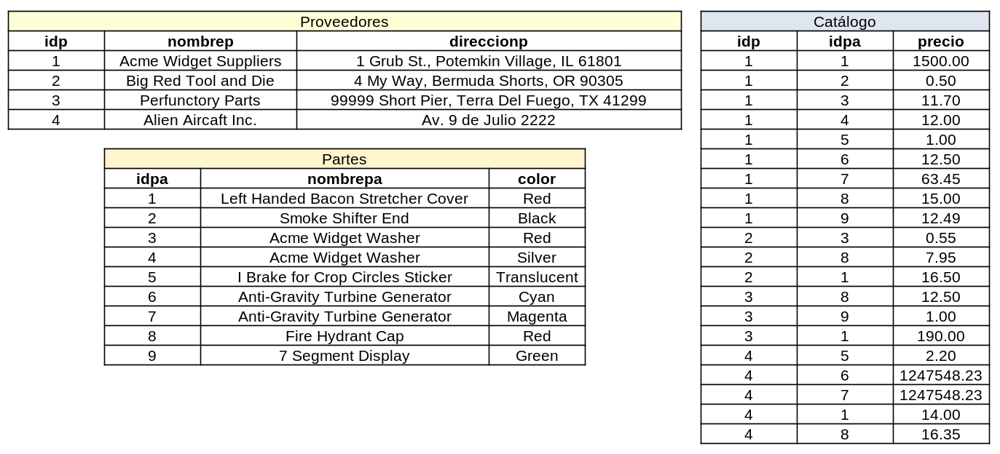

% Ejercicios de la Unidad IV

## Ejercicio 3

Considere el siguiente esquema: 

* Proveedores([idp: integer]{.underline}, nombrep: string, direccionp: string)

* Partes([idpa:integer]{.underline}, nombrepa: string, color: string)

* Catalogo([idp: integer, idpa: integer]{.underline}, precio: real)

Los campos clave están subrayados y el dominio de cada campo se especifica después del nombre. La relación "Catalogo" lista los precios a los que cada proveedor vende cada parte. Escriba las siguientes consultas en álgebra relacional: 

1. Encontrar los nombres de los proveedores que proveen alguna parte roja.

		π nombrep (proveedores ⋈ σ color == 'Red' (partes) ⋈ catalogo)

2. Encontrar los idps de los proveedores que proveen alguna parte roja o verde.
	
	Opción 1:

		π idp (proveedores ⋈ σ color == 'Red' or color == 'Green' (partes) ⋈ catalogo)

	Opción 2:
		
		pRojas = proveedores ⋈ catalogo ⋈ σ color == 'Red' (partes)

		pVerdes = proveedores ⋈ catalogo ⋈ σ color == 'Green' (partes)

		π idp (pRojas) ∪ π idp (pVerdes)

3. Encontrar los idps de los proveedores que proveen alguna parte roja o están en Av. 9 de Julio 2222.

		π idp (σ direccionp == 'Av. 9 de Julio 2222' (proveedores)) ∪ π idp (σ color == 'Red' (partes) ⋈ catalogo)

4. Encontrar los idps de los proveedores que proveen alguna parte roja y alguna parte verde.

		pRojas = proveedores ⋈ catalogo ⋈ σ color == 'Red' (partes)

		pVerdes = proveedores ⋈ catalogo ⋈ σ color == 'Green' (partes)

		π idp (pRojas) ∩ π idp (pVerdes)

5. Encontrar los idps de los proveedores que proveen todas las partes.

		π idp, idpa (catalogo) ÷ π idpa (partes)

	*Recordar que cuando se nos indica que encontremos "todo" de algo, se suele ocupar la división.*

6. Encontrar los idps de los proveedores que proveen todas las partes rojas.

		π idp, idpa (catalogo) ÷ π idpa (σ color == 'Red' (partes))

7. Encontrar los idps de los proveedores que proveen todas las partes rojas o verdes.

		π idp, idpa(catalogo) ÷ π idpa (σ color == 'Red'(partes)) ∪ π idp (catalogo ⋈ σ color == 'Green'(partes))

8. Encontrar los idps de los proveedores que proveen todas las partes rojas o todas las partes verdes.

		todosRojos = π idp, idpa (catalogo) ÷ π idpa (σ color == 'Red' (partes))

		todosVerdes = π idp, idpa (catalogo) ÷ π idpa (σ color == 'Green' (partes))

		todosRojos ∪ todosVerdes

9. Encontrar pares de idps tales que el proveedor con el primer idp vende más caro alguna parte que el proveedor con el segundo idp.

		aux = ρ idp ➡ idp_aux, idpa ➡ idpa_aux, precio ➡ precio_aux (catalogo)

		π idp, idp_aux, idpa, idpa_aux, precio, precio_aux (σ idp != idp_aux and idpa == idpa_aux and precio > precio_aux (catalogo * aux))

	_Proyecté más campos que los solicitados en la consigna para poder comprobar los resultados rápidamente._

10. Encontrar los idpas de las partes que son provistas por al menos dos proveedores diferentes.

		aux = ρ idp ➡ idp_aux, idpa ➡ idpa_aux, precio ➡ precio_aux (catalogo)

		π idp, idp_aux, idpa, idpa_aux (σ idp != idp_aux and idpa == idpa_aux (catalogo * aux))

11. Encontrar los idpas de las partes que son provistas por el proveedor llamado "Big Red Tool and Die" (Gran herramienta roja y [muere](https://youtu.be/X8OeBZQn3_w?si=lRIx3fkRbKop2dLS&t=218)).

		π nombrep, idpa(σ nombrep == "Big Red Tool and Die" (proveedores) ⋈ catalogo ⋈ partes)

12. Encontrar los idpas de las partes provistas por todos los proveedores a menos de $200 (si algún proveedor no provee la parte o la cobra más de $200, ésta no se selecciona).

		π idpa, idp (σ precio < 200 (catalogo)) ÷ π idp (proveedores)

	_Recordar que para obtener proveedores que provean todas las partes (ergo, un idp que "tenga" todas las idpa's), la consulta es:_
	
		π idp, idpa (catalogo) ÷ π idpa (partes)

	_En este punto nos piden los mismo pero al revés: un idpa que "tenga" todos los idp's._

