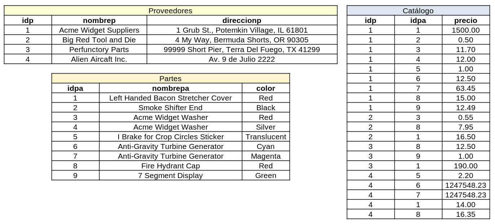

%Ejercicios de la Unidad IV

## Ejercicio 4

Considere el esquema Proveedores-Partes-Catálogo del punto anterior. Establezca cuál es el resultado de las siguientes consultas:

\

\

a. **π nombrep (π idpa (σ color == 'Red' (partes)) ⋈ σ precio < 100 (catalogo) ⋈ proveedores)**

	Arroja el nombre de los proveedores que proveen partes rojas a menos de $100.

	El resultado de la consulta fue:
	
	|nombrep         |
	|:--------------------:|
	|Acme Widget Suppliers|
	|Big Red Tool and Die|
	|Alien Aircraft Inc.|
	|Perfunctory Parts|

b. **π nombrep (π idpa (σ color == 'Red' (partes) ⋈ σ precio < 100 (catalogo) ⋈ proveedores))**

	Primero, dentro del paréntesis donde se hacen los _«natural joins»_ toma las partes rojas que son vendidas a menos de $100. Para dar esta información no haría falta hacer el _«natural join»_ con la relación de proveedores. Este resultado intermedio es el siguiente:

	|idpa|
	|:----------:|
	|1|
	|8|
	|3|

	Luego, trata de hacer la proyección del campo "nombrep" y falla, ya que el mismo no es parte de la relación.
	
c. **π nombrep (σ color == 'Red' (partes) ⋈ σ precio < 100 (catalogo) ⋈ proveedores) ∩ π nombrep (σ color == 'Green' (partes) ⋈ σ precio < 100 (catalogo) ⋈ proveedores)**

	Devuelve los nombres de los proveedores que tienen tanto partes rojas como verdes a menos de $100.

	El resultado de la consulta fue:

	|nombrep|
	|:-------:|
	|Acme Widget Suppliers|
	|Perfunctory Parts|
	
d. **π idp (σ color == 'Red' (partes) ⋈ σ precio < 100 (catalogo) ⋈ proveedores) ∩ π idp (σ color == 'Green' (partes) ⋈ σ precio < 100 (catalogo) ⋈ proveedores)**

	Ídem al punto anterior. El _«natural join»_ con la relación o tabla de proveedores está de más ya que esta vez se proyectará el idp, dato que se encuentra en la tabla de catálogos.
	
e. **π nombrep (π idp, nombrep (σ color == 'Red' (partes) ⋈ σ precio < 100 (catalogo) ⋈ proveedores) ∩ π idp, nombrep (σ color == 'Green' (partes) ⋈ σ precio < 100 (catalogo) ⋈ proveedores))**

	La consulta devuelve lo mismo que la consulta del punto **c**. La diferencia es que primero hace una intersección entre una tabla con proveedores que tienen partes rojas a menos de $100 con otra que tiene lo mismo pero con partes verdes. Este resultado "intermedio" es: 

	|idp|nombrep|
	|:---:|:-------:|
	|1|Acme Widget Suppliers|
	|3|Perfunctory Parts|

	Finalmente, sobre esta tabla proyecta el campo "idp", obteniendo así el mismo resultado que en el punto **c**.
